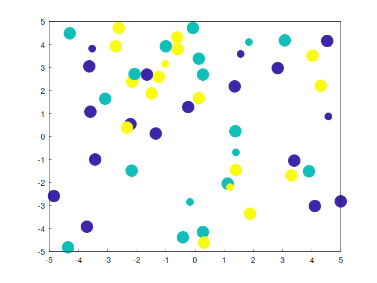

## KNN Classification C++

This a C++ implementation of KNN algorithm. It generates samples with two features(f1, f2) based on given boundaries and quantity.





## Installation
#### Tested on
* Ubuntu 20.04
* g++ 9.3.0
* gnuplot 5.2
* cmake 3.16.3
* [Matplot++ 1.1.0](https://github.com/alandefreitas/matplotplusplus)

To install gnuplot;
```
sudo apt-get install gnuplot 
```

clone the Matplot++ into root directory of project:
``` 
git clone https://github.com/alandefreitas/matplotplusplus.git
```

#### Building

``` 
cd build/
cmake ..
make
```

#### Running
```
cd ..
cd bin
./main.out
```
